# SCOM Management Pack Creator - Product Requirements Document (PRD)

## Executive Summary

The SCOM Management Pack Creator is a professional web-based tool designed to simplify the creation of System Center Operations Manager (SCOM) Management Packs through an intuitive step-by-step wizard interface. This tool empowers IT professionals to create production-ready Management Packs without deep XML knowledge.

## Product Overview

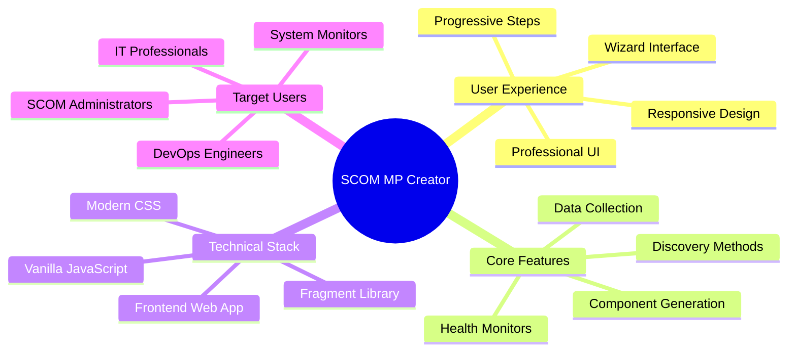

## User Journey Flow

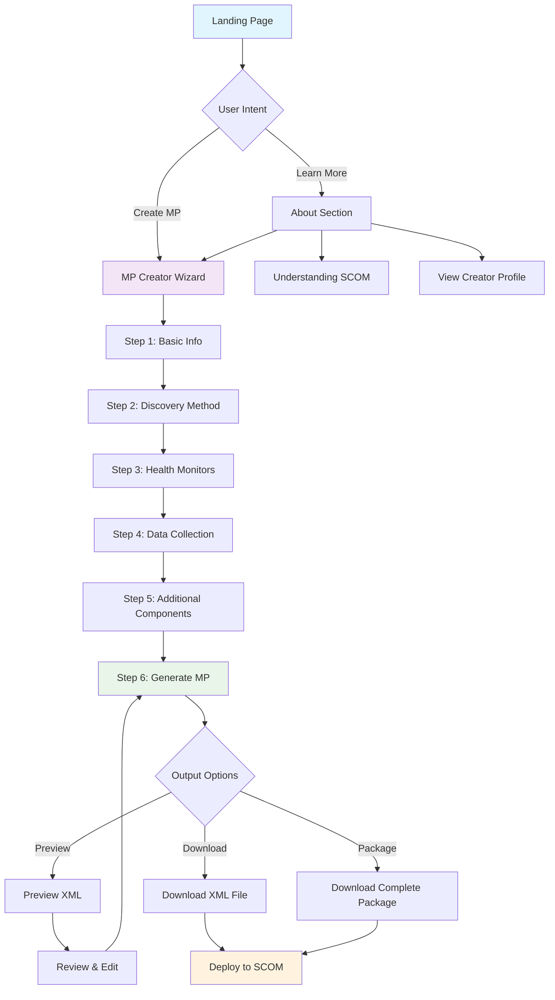

## System Architecture

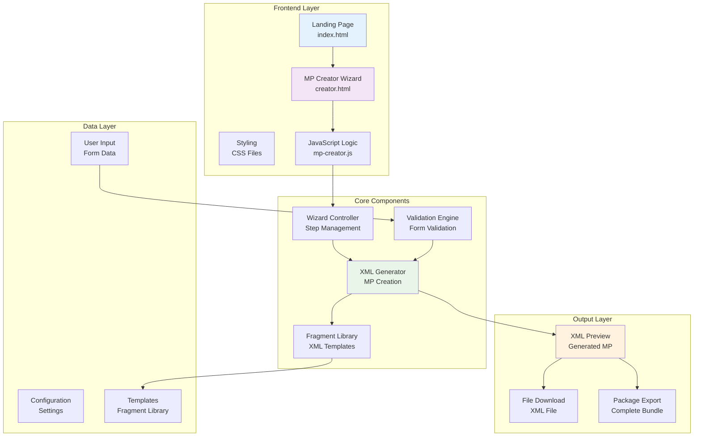

## Feature Requirements

### 1. User Interface Requirements

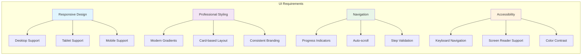

### 2. Functional Requirements

```mermaid
graph TD
    subgraph "Discovery Methods"
        A1[Registry Key Discovery]
        A2[Registry Value Discovery]
        A3[WMI Query Discovery]
        A4[Script Discovery]
        A5[Service Discovery]
        A6[Skip Discovery]
    end
    
    subgraph "Health Monitors"
        B1[Service Monitor]
        B2[Performance Monitor]
        B3[Event Log Monitor]
        B4[Script Monitor]
        B5[Port Monitor]
        B6[Registry Monitor]
    end
    
    subgraph "Data Collection Rules"
        C1[Performance Collection]
        C2[Event Alerts]
        C3[Script Alerts]
        C4[SNMP Alerts]
    end
    
    subgraph "Additional Components"
        D1[Groups]
        D2[Tasks]
        D3[Views]
        D4[Recovery Actions]
    end
    
    A1 --> E[MP Generation Engine]
    A2 --> E
    A3 --> E
    A4 --> E
    A5 --> E
    A6 --> E
    
    B1 --> E
    B2 --> E
    B3 --> E
    B4 --> E
    B5 --> E
    B6 --> E
    
    C1 --> E
    C2 --> E
    C3 --> E
    C4 --> E
    
    D1 --> E
    D2 --> E
    D3 --> E
    D4 --> E
    
    E --> F[Valid SCOM XML]
    
    style E fill:#ff9800
    style F fill:#4caf50
```

## User Stories and Acceptance Criteria

### Epic: MP Creation Wizard

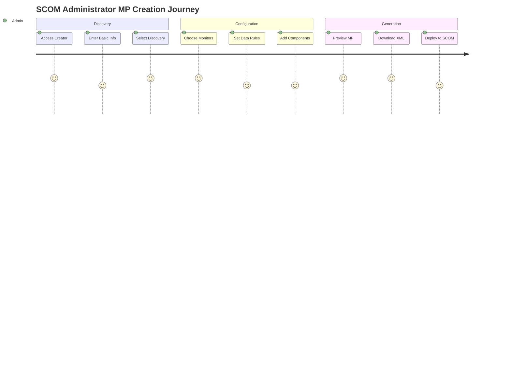

### User Stories

1. **As a SCOM Administrator**, I want to create Management Packs without XML knowledge, so I can monitor custom applications efficiently.

2. **As an IT Professional**, I want a guided wizard interface, so I can ensure all required components are included in my Management Pack.

3. **As a System Monitor**, I want to preview the generated XML, so I can validate the Management Pack before deployment.

4. **As a DevOps Engineer**, I want to download complete packages, so I can integrate MP deployment into my automation workflows.

## Technical Requirements

### Performance Requirements

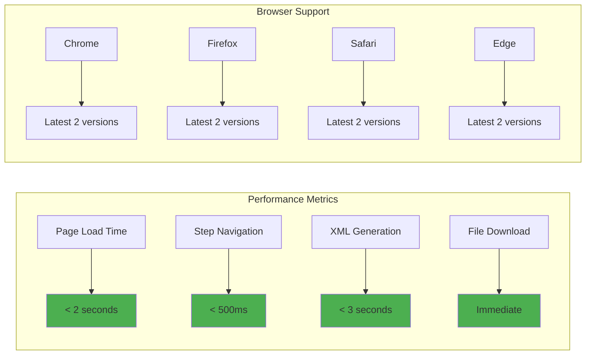

### Security Requirements

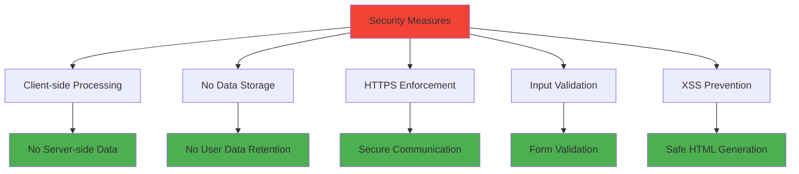

## Data Model

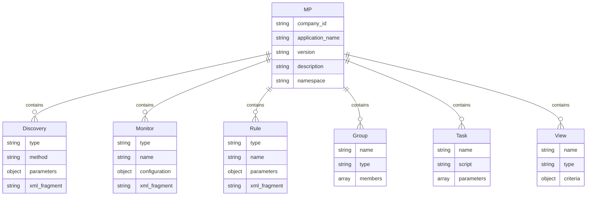

## Implementation Roadmap

```mermaid
gantt
    title SCOM MP Creator Implementation Timeline
    dateFormat  YYYY-MM-DD
    section Phase 1 - Core
    Basic UI Framework     :done, ui, 2024-01-01, 2024-01-15
    Wizard Navigation     :done, nav, 2024-01-16, 2024-01-30
    Fragment Library      :done, lib, 2024-02-01, 2024-02-15
    
    section Phase 2 - Features
    Discovery Methods     :done, disc, 2024-02-16, 2024-03-01
    Health Monitors       :done, mon, 2024-03-02, 2024-03-15
    Data Collection       :done, data, 2024-03-16, 2024-03-30
    
    section Phase 3 - Enhancement
    Additional Components :done, comp, 2024-04-01, 2024-04-15
    XML Generation        :done, xml, 2024-04-16, 2024-04-30
    Preview & Download    :done, prev, 2024-05-01, 2024-05-15
    
    section Phase 4 - Polish
    UI/UX Improvements    :done, polish, 2024-05-16, 2024-05-30
    Testing & Validation  :done, test, 2024-06-01, 2024-06-15
    Documentation        :done, docs, 2024-06-16, 2024-06-30
    
    section Phase 5 - Future
    Advanced Validation   :future, valid, 2024-07-01, 2024-07-15
    Template Import       :future, import, 2024-07-16, 2024-07-30
    Cloud Integration     :future, cloud, 2024-08-01, 2024-08-15
```

## Success Metrics

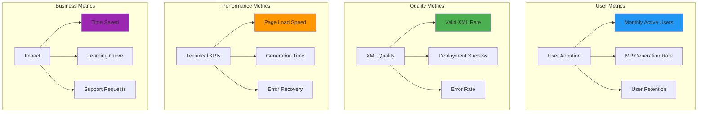

## Risk Assessment

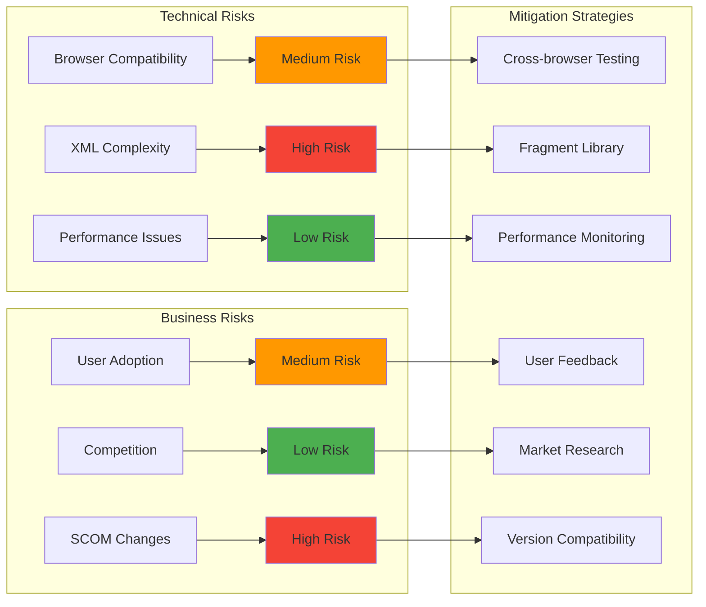

## Conclusion

The SCOM Management Pack Creator represents a comprehensive solution for simplifying SCOM Management Pack development. By providing an intuitive wizard-based interface, the tool democratizes MP creation and enables IT professionals to create production-ready monitoring solutions efficiently.

### Key Success Factors
1. **User-Centric Design**: Intuitive wizard interface with clear progression
2. **Technical Excellence**: Valid XML generation based on Microsoft best practices
3. **Comprehensive Features**: Complete MP component coverage
4. **Professional Quality**: Enterprise-ready output and deployment support

### Future Vision
The tool aims to become the de facto standard for SCOM Management Pack creation, with potential expansion into cloud monitoring solutions and integration with modern DevOps workflows.
